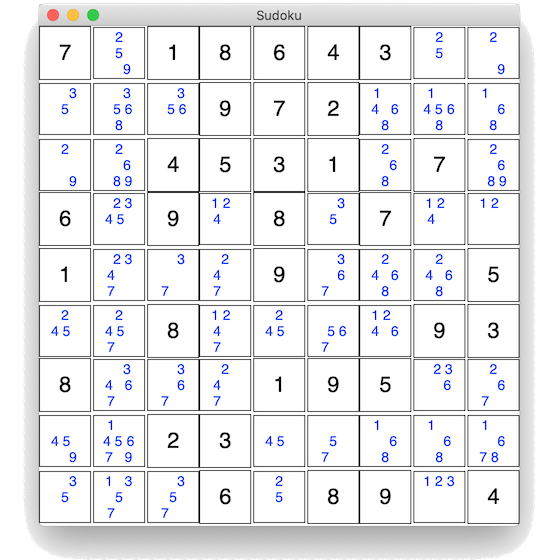

# sudoku-backtracking

Sudoku solver with backtracking, without recursion.

The solver works with a stack, a depth first search (DFS) is performed with "minimum remaining values" heuristic.
It is not optimized but will still perform decently, see benchmarks below.

Uses tkinter to show a visualization (with candidates):

Inspired by [Ali Spittel's post](https://medium.com/free-code-camp/coming-back-to-old-problems-how-i-finally-wrote-a-sudoku-solving-algorithm-3b371e6c63bd) and the amazing Peter Norvig essay ["Solving Every Sudoku Puzzle"](https://norvig.com/sudoku.html).

### Sudokus

* `magictour_easy.csv`: 1011 easy puzzles (without solutions), [source](http://magictour.free.fr/msk_009)
* `magictour_hard.csv`: 95 hard puzzles (without solutions), [source](http://magictour.free.fr/top95)
* `menneske_random.csv`: 90 puzzles from all difficulties (with solutions), [source](http://www.menneske.no/sudoku/eng/random.html)

### Benchmarking

On my 2013 MacBook Pro (2.7 GHz Dual-Core Intel Core i5), the solver performs like this:

* `magictour_easy.csv`: 1011 puzzles in 28.26 seconds (0.028s per puzzle) 
* `magictour_hard.csv`: 95 puzzles in 20.68 seconds (0.218s per puzzle)
* `menneske_random.csv`: 90 puzzles in 2.35 seconds (0.026s per puzzle)
